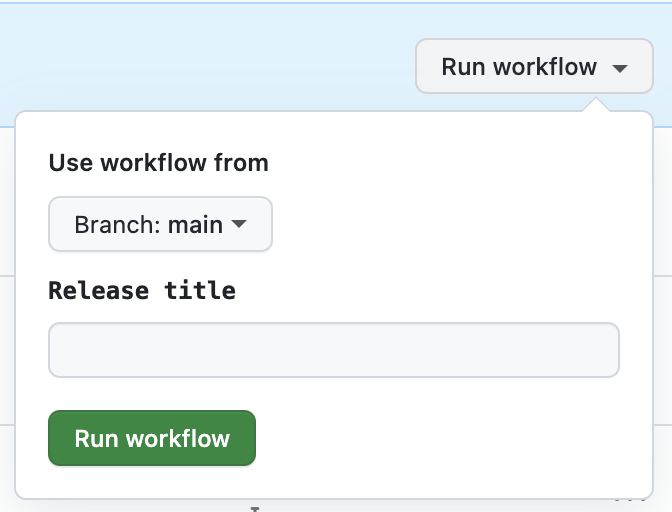

# blinq-release-bot

This GitHub App is for use internally to create releases and generate release notes.

## Description

The Blinq automated release bot will create a release branch when triggered, generate release notes based on the commit history and push these to GitHub.

### Usage

Create a `release.yml` workflow in your repository:

```yaml
name: Create Release

permissions:
  contents: write

on:
  workflow_dispatch:
    inputs:
      release_title:
        description: 'Release title'
        required: false

jobs:
  release:
    runs-on: ubuntu-latest
    permissions:
      contents: write
      pull-requests: write
    steps:
      - name: Create Release
        uses: BlinqOSS/blinq-release-bot@v1
        with:
          token: ${{ secrets.GITHUB_TOKEN }}
          release_title: ${{ github.event.inputs.release_title }}
```

To trigger, run the "Create Release" pipeline from your repository.



### Contributing

This repository requires semantic commit messages. Please use `git-cz` or similar.
